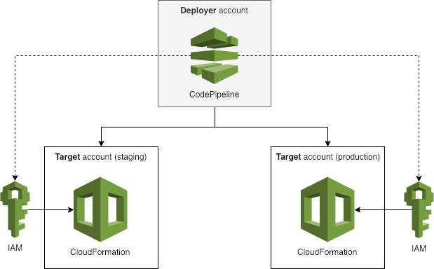

# Cross Account CodePipeline

The AWS CloudFormation template in this repository can be deployed in both a _"Deployer"_ account (as depicted below) and any number of _"Target"_ accounts. It provides a number of cross-account CloudFormation, CodePipeline and CodeBuild IAM roles, which can be assumed from the deployer account; in addition to an Artifact bucket and KMS key which are ready to be configured with CodePipeline.



Cross-account CodePipeline artifacts also have their ACL modified by a Lambda function to ensure the deployer account can access them in subsequent actions within the pipeline.

When implementing cross-account pipelines, a macro is provided (as demonstrated in the example template) to enable you to alias accounts with the target IAM role arns; enabling templates to refer to target accounts by alias, as opposed to any hardcoded account IDs. The configuration of this is documented below.

Where possible, roles and policies are locked down to ensure that objects are secured and encrypted.

## Getting Started

Before doing anything, create an `aliases.json` file, which contains a map between logical account names, such as "Dev", "Staging" and "Production", with the associated AWS Account IDs, as described in the example below.

```json
{
  "Development": "456789015432",
  "Staging": "197465729483",
  "Production": "587968243760"
}
```

These mappings will be used as aliases throughout your CodePipeline actions, in-order to  determine which account an action is being enacted upon. This also allows you to easily update account IDs in the future, if necessary.

`AccountAliasesJSON`


`AdministeringAccountIds`...